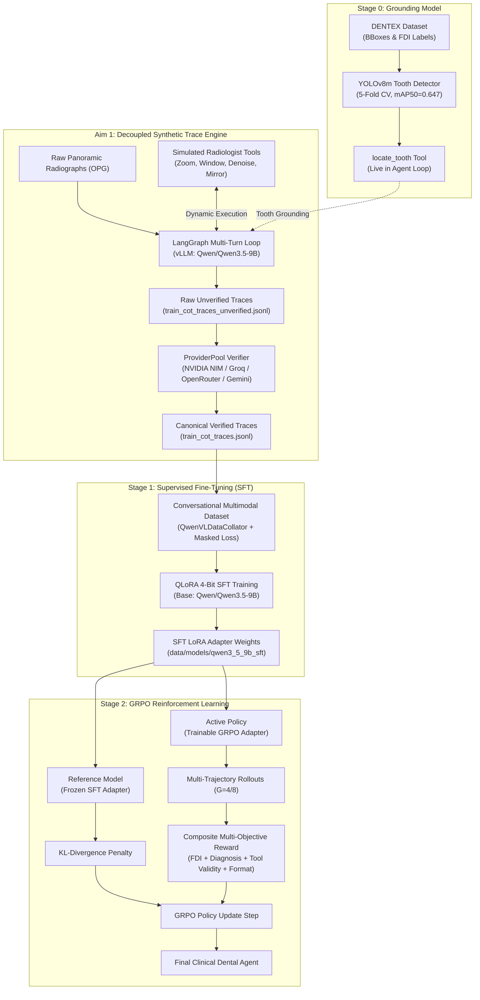
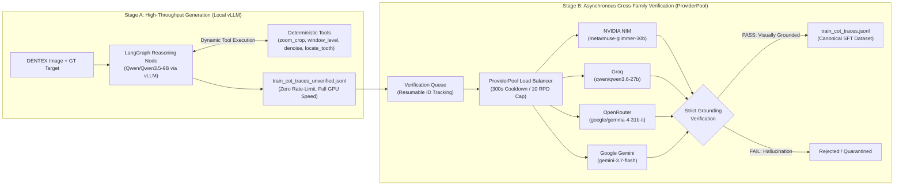
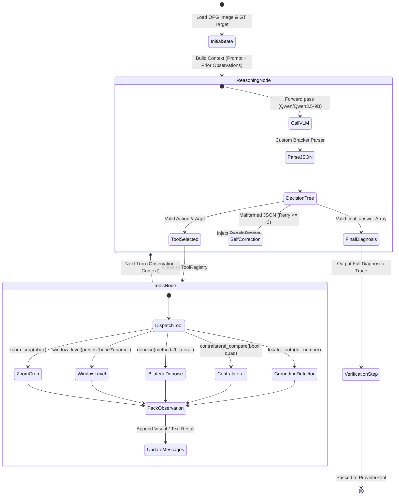
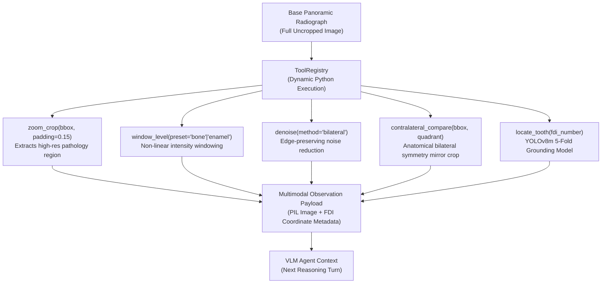
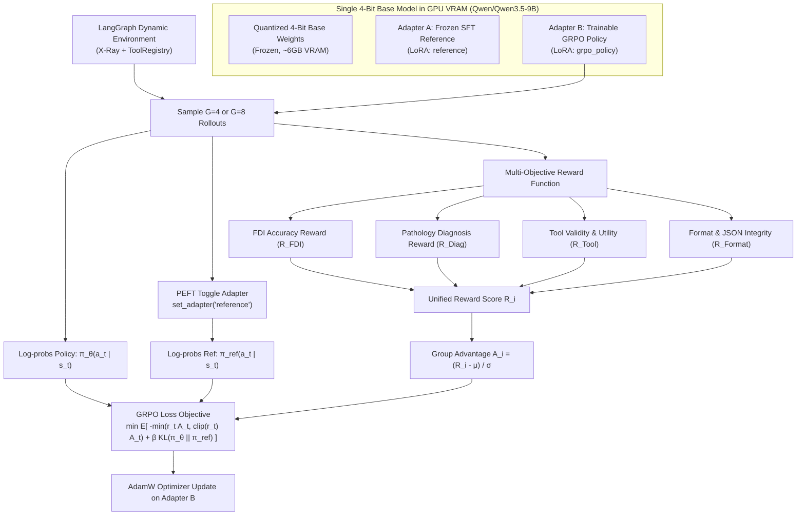

# Visualization Prompts & Diagrams for VLM-DENTAL

This document contains publication-ready diagram definitions (Mermaid and Image Generation Prompts) for the **VLM-DENTAL** architecture, LangGraph reasoning loops, decoupled data engines, and dual-adapter reinforcement learning pipelines.

---

## 1. High-Level End-to-End System Architecture

### Diagram Specification (Mermaid)

### Image Generation Prompt (Publication Art)
> **Prompt:** Professional scientific diagram of an AI medical vision-language model training system for dental panoramic radiography (VLM-DENTAL). Dark high-tech clinical UI theme, glowing cyan and amber accents. Left side: Panoramic X-ray feeding into a multi-turn LangGraph agent with tool icons (magnifying glass zoom, contrast windowing, bilateral symmetry mirror, AI tooth detector). Middle: 2-stage decoupled generation pipeline with a local fast GPU server feeding into an asynchronous multi-cloud verifier pool. Right side: Dual-adapter LoRA reinforcement learning engine (GRPO) optimizing diagnostic accuracy and FDI tooth notation. Clean, isometric vector illustration, crisp typography, clean medical AI schematic, 8k resolution.

---

## 2. The 2-Stage Decoupled Trace Generation & Verification Engine

### Diagram Specification (Mermaid)

### Image Generation Prompt
> **Prompt:** Detailed technical flow diagram illustrating a decoupled two-stage data synthesis pipeline for AI training. Stage 1 on the left is a high-speed local GPU engine executing LangGraph multi-turn tool loops against dental X-rays at high frame rates. In the center, unverified JSONL traces queue up. Stage 2 on the right is a multi-cloud verification gateway round-robining across four external AI APIs (NVIDIA, Groq, OpenRouter, Google) with cooling timers and strict visual grounding checks, filtering into a verified golden dataset. Clean infographic style, futuristic blueprint aesthetic, sleek gradient colors on deep slate background.

---

## 3. LangGraph Interactive Multi-Turn Diagnostic Loop

### Diagram Specification (Mermaid)

### Image Generation Prompt
> **Prompt:** Futuristic UI workflow visualization of an autonomous medical AI agent's LangGraph decision cycle. Circular agent reasoning loop showing state transitions: Observation of panoramic dental X-ray -> Multi-modal reasoning turn -> Tool selection branching into specialized medical tools (magnification loupe, bone contrast window, symmetry mirror, AI tooth detector) -> Real dynamic execution returning enhanced visual crops -> Convergence into structured FDI dental diagnostic report. Modern dark theme with cyan, violet, and emerald glowing nodes, ultra-clean UI design.

---

## 4. Simulated Radiologist Tool Suite Architecture

### Diagram Specification (Mermaid)

---

## 5. Dual-Adapter GRPO Reinforcement Learning Architecture

### Diagram Specification (Mermaid)

